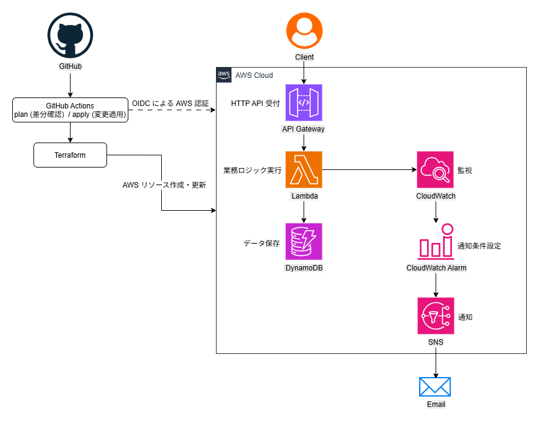

# AWS Serverless CI/CD Infrastructure

## Project Overview

TerraformとGitHub Actionsを用いてAWSサーバーレス基盤を構築し、  
Infrastructure as Code・CI/CD・OIDC認証を組み合わせた自動デプロイ環境を実装したポートフォリオプロジェクトです。

---

## Architecture

以下のサーバーレス構成でシステムを構築しています。

```
Client
  │
  ▼
Amazon API Gateway
  │
  ▼
AWS Lambda (Alias → Version)
  │
  ▼
Amazon DynamoDB
```

監視構成

```
AWS Lambda
  │
  ▼
Amazon CloudWatch
  │
  ▼
CloudWatch Alarm
  │
  ▼
Amazon SNS
  │
  ▼
Email Notification
```

CI/CD構成

```
GitHub
  │
  ▼
GitHub Actions
  │
  ▼
Terraform
  │
  ▼
AWS Infrastructure
```

---

## Architecture Diagram

システム全体のAWS構成図は以下の通りです。



---

## Technologies

本プロジェクトでは以下の技術を使用しています。

| Category | Technology |
|---|---|
| IaC | Terraform |
| CI/CD | GitHub Actions |
| Authentication | OIDC (OpenID Connect) |
| API | Amazon API Gateway |
| Compute | AWS Lambda |
| Database | Amazon DynamoDB |
| Monitoring | Amazon CloudWatch |
| Notification | Amazon SNS |

---

## Terraform Backend

TerraformのState管理にはリモートバックエンドを使用しています。

| Component | Service |
|---|---|
| State Storage | Amazon S3 |
| State Lock | Amazon DynamoDB |

これにより、複数環境からのTerraform実行時でもStateの競合を防ぎ、安全なIaC運用を実現しています。

---

## CI/CD Pipeline

GitHub Actionsを利用してTerraformのCI/CDを構築しています。

Pull Request作成時

```bash
terraform fmt
terraform init
terraform validate
terraform plan
```

mainブランチへのマージ時

```bash
terraform apply
```

これによりインフラ変更はPull Requestを経由して安全にデプロイされます。

---

## Security

GitHub ActionsからAWSへの認証にはOIDC（OpenID Connect）を使用しています。

これにより

- AWSアクセスキーのSecrets保存不要
- 一時的な認証情報による安全なアクセス
- IAMロールによる権限制御

を実現しています。

OIDC Provider

```
token.actions.githubusercontent.com
```

---

## Directory Structure

```
aws-serverless-cicd-iac
├─ docs
│  └─ design.md
├─ infra
│  ├─ main.tf
│  ├─ providers.tf
│  ├─ backend.tf
│  └─ variables.tf
├─ lambda
│  ├─ hello.py
│  └─ hello.zip
└─ .github
   └─ workflows
      ├─ terraform-plan.yml
      └─ terraform-apply.yml
```

---

## API Example

保存

```http
POST /hello
Content-Type: application/json

{
  "id": "001",
  "message": "hello dynamodb"
}
```

取得

```http
GET /hello?id=001
```

---

## Design Document

詳細設計は以下を参照してください。  
[Design Document](docs/design.md)

---

## Future Improvements

- Lambda Canary Deployment
- Terraform Module化
- API Gateway Authentication (Cognito / JWT)
- Observability強化 (AWS X-Ray / Structured Logs)

---